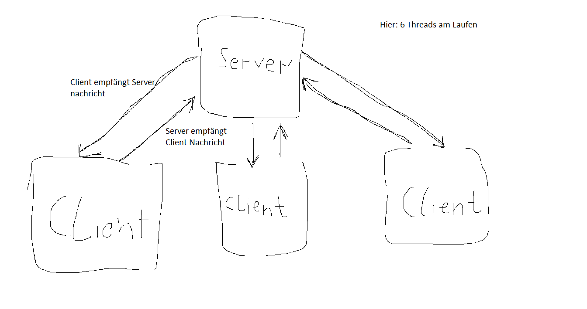
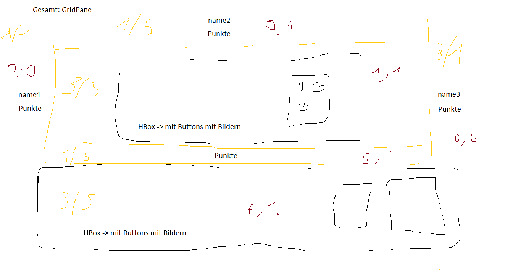

---

# Hearts

---

Hearts is a funny cardgame. If you don't know it you maybe [visit this page](https://de.wikipedia.org/wiki/Hearts). In this project I and Daniela Werlinger programmed this cardgame with java and local server. 

---

The Game looks like this:

https://user-images.githubusercontent.com/50902823/172191590-de1f3c78-aa5d-4870-addb-b6465989b51e.mp4

---

https://user-images.githubusercontent.com/50902823/172191626-95a897f4-68ea-444e-8c6e-dedae2460738.mp4

---

The server functionality is sketched as follow:

</img>

---

And the GUI sketching looks so:

</img>

---
